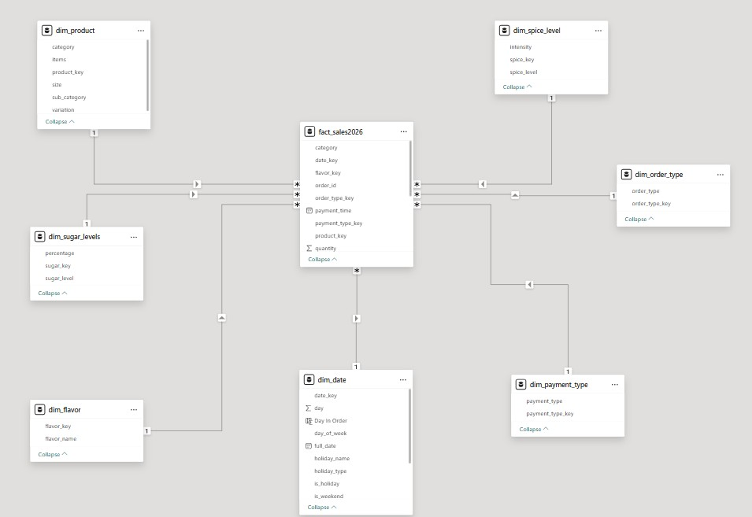
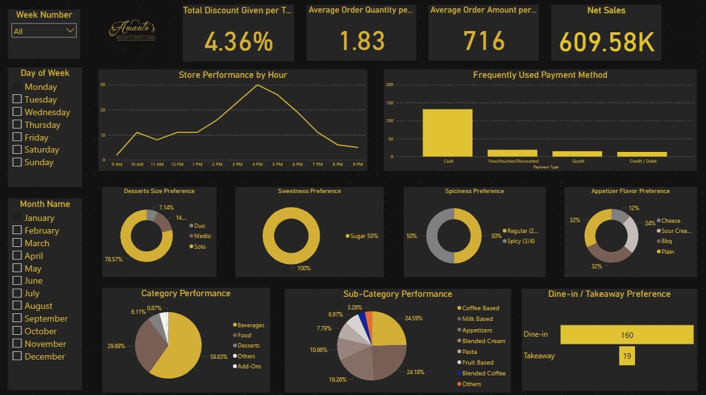

# ☕Airflow—BigQuery-DBT ELT/EtLT Pipeline

> A production-grade, end-to-end data pipeline for a café point-of-sale system — built with Apache Airflow, dbt, Google BigQuery, and Power BI.


---

## 📌 Overview

A **live, production-grade data pipeline** built on a real-world café 
point-of-sale (POS) dataset — the same data source used from the [last ETL pipeline project](https://github.com/robimengote/Amante-s-Supabase-Full-Cloud-ETL-Pipeline). 

This is not a static or simulated project. The pipeline runs on a schedule, 
processes real transactions, handles late-arriving and malformed data, and serves a live Power BI dashboard backed by Google BigQuery.

The focus is the **engineering layer**: automated orchestration, incremental 
loading, multi-layer data validation, and recovery flows for bad data — all 
wired together into a single, observable pipeline.

**Key engineering decisions demonstrated:**
- Incremental dbt models with late-arriving row support via `is_reprocessed` flag
- Quarantine layer that isolates bad rows without halting the pipeline
- MERGE-based idempotency so the pipeline is safely re-runnable
- dbt schema tests as a circuit breaker with BigQuery audit tables for precise recovery

---

## 🏗️ Architecture
```
┌─────────────────────────────────────────────────────────┐
│                    POS System (Raw CSV)                  │
└─────────────────────────┬───────────────────────────────┘
                          ↓
                 Python ELT (Extraction & Validation)
                 ↙                          ↘
          Good Rows                       Bad Rows 
              ↓                               ↓
      GCS (Data Lake)              Quarantine Table (BigQuery)
              ↓                               ↓
   staging_fact_sales                  Repair row manually
              ↓                               ↓
          dbt run                    load_fixed_rows RPC (is_reprocessed = TRUE)
              ↓                               ↓
          dbt test                   delete_fixed_rows RPC
              ↓                               ↓
   fact_sales2026 + Dims             Re-run dbt run
              ↓                               ↓
      Power BI Dashboard             reset_reprocessed_flag RPC (is_reprocessed = FALSE)


⚠️ The quarantine recovery flow (right side) is manually triggered. It does not run automatically as part of the scheduled pipeline.

```

---

## 🛠️ Tech Stack
 
| Layer | Tool |
|---|---|
| Orchestration | Apache Airflow (Dockerized) |
| Extraction & Load | Python (pandas, google-cloud-bigquery) |
| Data Lake | Google Cloud Storage (GCS) |
| Data Warehouse | Google BigQuery |
| Transformation | dbt (dbt-bigquery, dbt-utils) |
| Data Quality | dbt schema tests + audit tables |
| Visualization | Power BI |
| Containerization | Docker + Docker Compose |
| Version Control | Git + GitHub |
 
---
 
## 📁 Project Structure
 
```
Modern-ELT-Pipeline/
├── dags/                          # Airflow DAG definitions
│   └── amantes_pipeline.py        # Main pipeline DAG
├── amantes_dbt/                   # dbt project
│   ├── models/
│   │   ├── facts/
│   │   │   ├── fact_sales2026.sql # Incremental fact table
│   │   │   └── schema.yml         # dbt schema tests
│   │   └── dimensions/
│   │       └── _dimensions.yml    # Dimension table tests
│   ├── seeds/                     # Static dimension CSVs
│   ├── macros/                    # dbt macros
│   ├── dbt_project.yml
│   └── packages.yml               # dbt_utils dependency
├── docker-compose.yaml            # Airflow + dbt container setup
├── requirements.txt               # Python dependencies
├── profiles_guide.yml             # dbt profiles setup guide
├── .gitignore
└── README.md
```
 
---
 
## ⚙️ Pipeline Features
 
### Incremental Loading
The fact table uses dbt's incremental strategy — only new rows are processed on each run, keeping costs low and performance high on BigQuery.
 
```sql
WHERE (
    CAST(payment_time AS DATETIME) > (SELECT MAX(payment_time) FROM {{ this }})
    OR is_reprocessed = TRUE
)
```
 
### Quarantine Layer
Rows that fail validation during extraction are routed to a quarantine table instead of being silently dropped. Once fixed, they are reinserted into staging with `is_reprocessed = TRUE` so dbt picks them up on the next run regardless of their original timestamp.
 
### Idempotency
A `MERGE`-based deduplication stored procedure ensures the pipeline can be safely re-run for the same date without producing duplicate rows in BigQuery.
 
### Multi-layer Data Validation
| Layer | Tool | What it catches |
|---|---|---|
| Extraction | Python quarantine logic | Malformed rows, unknown products |
| Staging | MERGE dedup procedure | Duplicate rows |
| Transformation | dbt schema tests | Nulls, broken FK relationships, invalid measures |
| Recovery | dbt audit tables + stored procedures | Precise identification and removal of bad rows |
 
### dbt Schema Tests
```yaml
- not_null
- dbt_utils.unique_combination_of_columns  # composite key
- dbt_utils.expression_is_true             # business rules
  - payment_type_key != 0  (severity: error)
  - order_type_key != 0    (severity: error)
  - product_key != -1      (severity: warn)
  - quantity > 0           (severity: error)
```
 
### Recovery Stored Procedures
| Procedure | Purpose |
|---|---|
| `dedup_staging_fact_sales` | Removes duplicates after loading data |
| `load_fixed_quarantine_rows` | Reinserts fixed rows with `is_reprocessed = TRUE` |
| `reset_reprocessed_flag` | Resets flag after dbt processes rows |
| `dbt_recovery_int` | Fixes broken rows under INT columns and sets `is_reprocessed = TRUE`|
| `dbt_recovery_str` | Fixes broken rows under STRING columns and sets `is_reprocessed = TRUE` |
---
 
## 🌟 Star Schema
 
The data model follows a classic Star Schema with `fact_sales2026` at the center, surrounded by seven dimension tables. The model view below was generated directly from Power BI.
 

 
---
 
## 🚀 Getting Started
 
### Prerequisites
- Docker + Docker Compose
- Google Cloud Platform account
- GCP Service Account with BigQuery and GCS permissions
- dbt CLI (optional for local runs)
 
### 1. Clone the repo
```bash
git clone https://github.com/robimengote/Modern-ELT-Pipeline.git
cd Modern-ELT-Pipeline
```
 
### 2. Set up environment variables
```bash
cp .env.example .env
# Fill in your GCP project ID, dataset, and GCS bucket
```
 
### 3. Set up dbt profiles
```bash
# Follow the guide in profiles_guide.yml
# Create ~/.dbt/profiles.yml with your BigQuery credentials
```
 
### 4. Add your GCP service account key
```bash
mkdir keys/
# Place your service account JSON key in keys/
```
 
### 5. Start Airflow
```bash
docker-compose up -d
```
 
### 6. Install dbt dependencies
```bash
docker exec -it <airflow_container> bash
cd /opt/airflow/amantes_dbt
dbt deps
```
 
### 7. Access Airflow UI
```
http://localhost:8080
```
 
---
 
## 🧪 Running dbt Manually
 
```bash
# Run the fact table model
dbt run --select fact_sales2026
 
# Run schema tests
dbt test --select fact_sales2026
 
# Run everything
dbt run && dbt test
```
 
---
 
## 📊 Power BI Dashboard
 
The Power BI dashboard connects directly to BigQuery and provides:
- Daily and monthly sales trends
- Revenue breakdown by category and sub-category
- Payment type and order type distribution
- Product performance analysis



 
---
 
## 🔐 Security Notes
 
- GCP service account keys are stored in `keys/` which is excluded from version control via `.gitignore`
- `profiles.yml` is never committed — use `profiles_guide.yml` as a reference
- `.env` is excluded from version control
 
---
 
## 📝 License
 
MIT License — feel free to use this as a reference for your own pipeline projects.